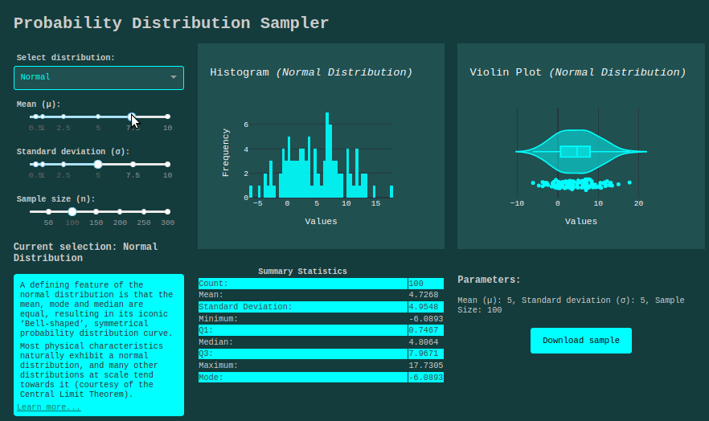

# Probability Distribution Sampler

A dashboard to help explore some of the most common statistical distributions. Made with [SciPy][1], powered by [Dash][2].

You can [try it out here][3].

[][3]

To run it locally,

1. Download the files, and create a virtual environment:

    ```bash
    git clone https://github.com/Tim-Abwao/probability-distributions-with-dash.git
    cd probability-distributions-with-dash
    python3 -m venv venv
    source venv/bin/activate
    ```

2. Install the required packages, and launch the app:

    ```bash
    pip install --upgrade pip
    pip install -r requirements.txt
    waitress-serve distributions_dashboard:server
    ```

[1]: https://www.scipy.org/
[2]: https://dash.plotly.com/
[3]: https://probability-distributions.herokuapp.com/
