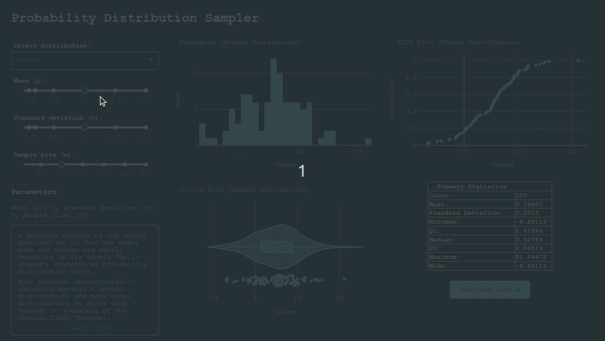

# Probability Distribution Sampler

A dashboard to help explore some of the most common probability distributions. Powered by [Dash][dash] & [SciPy][scipy].

You can [try it out here][app-link], courtesy of [Render][render].

>**NOTE:** Free-hosted apps might take a while to load since they are shut down when not in use.



## Running locally

1. Download the files, and create a virtual environment:

    ```bash
    git clone https://github.com/Tim-Abwao/probability-distributions-with-dash.git
    cd probability-distributions-with-dash
    python3 -m venv venv
    source venv/bin/activate
    ```

2. Install the required packages, and launch the app:

    ```bash
    pip install -U pip
    pip install -r requirements.txt
    waitress-serve dist_dashboard:server
    ```

[app-link]: https://probability-distributions.onrender.com
[dash]: https://dash.plotly.com/
[render]: https://render.com/
[scipy]: https://scipy.org/
